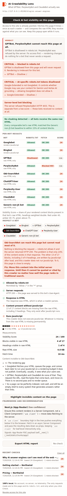

# AI Crawlability Lens

Googlebot renders your JavaScript. GPTBot, PerplexityBot and ClaudeBot don't.

A Chrome extension that fetches your page exactly as each AI crawler sees it — raw and
unrendered — and shows you what content is invisible to AI search engines, whether
you're blocked in `robots.txt`, and whether your site serves different content to
different bots. 100% local; no account, no server, no data leaves the browser.

**→ [`ai-crawlability-lens/`](ai-crawlability-lens) — the extension. Install and full
documentation in [its README](ai-crawlability-lens/README.md).**

Load it unpacked at `chrome://extensions`. No build step, no dependencies.

## Repository layout

| Path | What it is |
|---|---|
| [`ai-crawlability-lens/`](ai-crawlability-lens) | The extension. This folder is what you load unpacked. |
| [`ai-crawlability-lens/DECISIONS.md`](ai-crawlability-lens/DECISIONS.md) | Every non-obvious design choice and why it was made. |
| [`tests/`](tests) | Verification suites — 184 assertions, including a real-Chromium end-to-end run. Not part of the extension package. |
| [`SHIPPING.md`](SHIPPING.md) | How to take it live — Web Store route, internal route, and what only you can do. |
| [`PRIVACY.md`](PRIVACY.md) | Privacy policy. Needs a public URL before a Store submission. |
| [`tools/`](tools) | Icon generators, the concept sheet, the Store packager and screenshot builder. See [`tools/README.md`](tools/README.md). |
| [`docs/screenshots/`](docs/screenshots) | UI screenshots, captured from the real extension against a demo fixture site. |
| [`docs/icon-sheet.html`](docs/icon-sheet.html) | Icon candidates compared at 16/32/48/128 and in mock browser toolbars. |
| [`docs/store/`](docs/store) | Chrome Web Store screenshots, 1280×800. |
| [`docs/ui-demo.html`](docs/ui-demo.html) | Self-contained interactive walkthrough of the UI. Open it in a browser; no server needed. |

