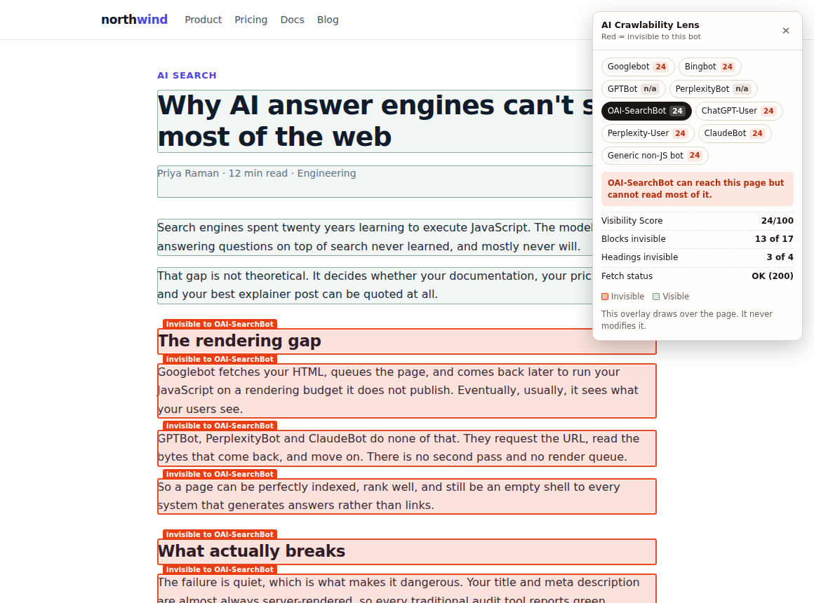
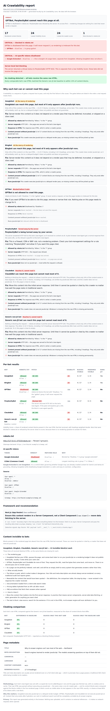

# AI Crawlability Lens

**Googlebot renders your JavaScript. GPTBot, PerplexityBot and ClaudeBot mostly don't.**

This Chrome extension fetches your page exactly as each AI crawler sees it — raw and
unrendered — and shows you precisely what content is invisible to AI search engines,
whether you're blocked in `robots.txt`, and whether your site serves different content
to different bots.

100% local. No account, no server, no data leaves the browser.

---

## What it looks like

| | |
|---|---|
|  |  |
| **Popup** — robots.txt criticals first, per-bot table, bot tabs, framework fix, export, history. | **On-page overlay** — every block invisible to the selected bot outlined in red, visible blocks in green. Drawn over the page; the page is never modified. |



*Standalone HTML report — self-contained, makes zero network requests when opened.*

Screenshots are of a deliberately client-rendered demo site whose `robots.txt` disallows
GPTBot and Google-Extended, and whose server returns 403 to PerplexityBot — so every
finding type appears at once. Dark mode: [`popup-dark.png`](../docs/screenshots/popup-dark.png).

**The mark** is *dissolve*: a solid mass whose right edge comes apart into discrete
squares that thin out and stop before the far edge — coherent matter, serrated edge,
scatter, void. The surviving fraction is about a third of the frame, which is roughly
what a client-rendered page actually delivers to a crawler. Every tone is pinned near
relative luminance Y=0.213, the only band clearing 3:1 against both Chrome toolbar
greys, so the hue travels and the contrast does not. See
[`tools/README.md`](../tools/README.md) to regenerate it.

---

## The problem this exists for

Most JavaScript-heavy sites operate on an assumption that used to be safe:

> "If Google can eventually render it, we're fine."

AI answer engines don't work that way.

| Crawler | Executes JavaScript? | What it decides |
|---|---|---|
| Googlebot | Yes, on a delayed render budget | Google Search |
| Bingbot | Yes, on a tighter budget | Bing, and Copilot |
| **GPTBot** (OpenAI) | **No** | OpenAI training data |
| **OAI-SearchBot** (OpenAI) | **No** | **Whether ChatGPT search can cite you** |
| **ChatGPT-User** (OpenAI) | **No** | Live fetch during an answer |
| **PerplexityBot** | **No** | Perplexity's index |
| **Perplexity-User** | **No** | Live fetch during an answer |
| **ClaudeBot** (Anthropic) | **No** | Anthropic's crawler |

> **GPTBot is not the one that matters most.** GPTBot is training-data crawling;
> **OAI-SearchBot** builds the index behind ChatGPT search. Disallowing GPTBot while
> leaving OAI-SearchBot allowed is a common and entirely reasonable configuration — and
> so is the reverse, by accident. Checking only GPTBot answers the wrong question, in
> exactly the way checking only Googlebot misses Google-Extended.

A page can look perfect to a human, pass every traditional SEO check, rank in Google —
and be near-100% invisible to every AI answer engine, because all its content is
client-side rendered. Your `<title>` and meta description are server-rendered, so the
audit tools go green. The content that would actually get cited never exists in the HTML
a crawler receives.

This extension proves that gap, on the current page, on demand.

### What this is not

It is not a CSR/SSR detector. That space is already well served — SEO Render Insight
Tool, CSR vs SSR Detector, chrome-ssr-csr — and they all answer the same question:
"will Googlebot eventually render this?" There are deliberately no performance metrics
here (no TTFB, FCP or LCP) and no framework fingerprint database.

Three things here exist nowhere else:

1. **Per-AI-bot raw-fetch visibility** — the page fetched as each crawler, with a real
   User-Agent, and diffed against what you see — plus a plain-English verdict on *why*
   each one can or cannot read it.
2. **robots.txt bot-blocking detection** — including `Google-Extended`, the token
   almost nobody knows about.
3. **Cloaking detection between bots** — whether your infrastructure quietly serves
   different HTML to different crawlers.

---

## Install (unpacked)

No build step. No dependencies. The folder loads as-is.

1. Clone or download this repository.
2. Open `chrome://extensions`.
3. Turn on **Developer mode** (top right).
4. Click **Load unpacked** and select the `ai-crawlability-lens/` folder.
5. Pin the extension to your toolbar.

Requires Chrome 116 or later.

## Use

1. Navigate to the page you want to audit.
2. Click the extension icon in the toolbar.
3. Click **Check AI bot visibility on this page**.
4. Chrome asks for access **to that one site**. Grant it.
5. Wait a few seconds — nine fetches run one at a time. Keep the popup open.

You get: a per-bot table, a CRITICAL banner if any bot is blocked in `robots.txt`, a
cloaking finding, a framework-specific recommendation, an on-page highlight overlay,
and a standalone HTML report you can send to a client.

---

## Methodology

### 1. robots.txt, first

`<origin>/robots.txt` is fetched once and parsed properly — RFC 9309 group semantics
plus the `*` / `$` wildcard dialect every major crawler honours:

- Consecutive `User-agent:` lines form one group; groups naming the same token merge.
- A crawler obeys exactly **one** group: the longest product token that is a
  case-insensitive prefix of its own name. `*` is a fallback, consulted only when
  nothing specific matches — it is never merged with a specific group.
- Within that group, the **longest matching pattern wins**, regardless of file order.
- On an equal-length tie, **`Allow` beats `Disallow`**.

So `Disallow: /` followed by `Allow: /blog/` leaves `/blog/post` crawlable.

Tokens evaluated: `Googlebot`, `Bingbot`, `GPTBot`, `PerplexityBot`, `ClaudeBot`,
`anthropic-ai`, `CCBot`, `Google-Extended`.

A bot disallowed here is **CRITICAL regardless of rendering** — it never requests the
page at all, so its Visibility Score is a number about content it will never fetch. The
UI shows no score for those bots, on purpose.

> **`Google-Extended` is not `Googlebot`.**
> It is not a crawler and has no User-Agent string. It is a control token governing
> whether Google may use already-crawled content for **Gemini and Vertex AI grounding**.
> `Allow: /` for Googlebot and `Disallow: /` for Google-Extended is a completely valid
> configuration, and it means your content can rank in Google Search while being barred
> from Google's AI answers. This surprises almost everyone, which is why it gets its
> own row and its own banner.

### 2. Fetching as each bot

Browsers forbid setting `User-Agent` via `fetch()` — it is a forbidden header name, and
the browser drops it silently rather than erroring. So the extension installs a single
scoped `chrome.declarativeNetRequest` dynamic rule before each fetch:

```js
condition: {
  urlFilter: `|${origin}/`,                 // left-anchored to the target origin
  initiatorDomains: [chrome.runtime.id],    // ONLY this extension's own requests
  resourceTypes: ['xmlhttprequest']
},
action: { type: 'modifyHeaders', requestHeaders: [{ header: 'User-Agent', operation: 'set', value: ua }] }
```

`initiatorDomains` scoped to the extension's own ID is the safety property that matters:
the rule can only ever match a request this extension itself made. It cannot touch your
browsing, other tabs, other extensions, or the page's own requests. Nothing is ever
blocked or redirected — one request header is set, on our own fetches.

Fetches are **strictly sequential**, and the rule is only swapped after the response
body has been fully read. There is one rule ID in play; running in parallel would race
on the swap and attribute a response to the wrong User-Agent — a failure that would
still *look* correct. A few extra seconds is worth not doing that.

Every fetch: `credentials: 'omit'` (so you see what a logged-out crawler sees, not what
your session shows), `cache: 'no-store'`, `redirect: 'follow'`, 8-second
`AbortController` timeout.

A per-bot failure is a **first-class finding**, not a skipped row. A 403 to GPTBot's
User-Agent when the plain-UA baseline gets a 200 is a strong signal that something in
your stack is turning AI crawlers away — and it is reported distinctly from a low
Visibility Score, because they are entirely different problems.

### 3. The diff

The raw HTML is parsed with `DOMParser`, which produces an inert document — **no script
executes, no subresource loads**. That is precisely the semantics we want: it is a
faithful model of a crawler that does not run JavaScript.

`<script>`, `<style>` and `<noscript>` are stripped, then content blocks are extracted
from both sides: headings (`h1`–`h6`), `p`, `li`, `td`/`th`, `blockquote`. Only the
innermost block counts, so `<li><p>text</p></li>` is one block, not two. Navigation,
headers, footers and asides are excluded — boilerplate is usually server-rendered even
on SPAs, so counting it inflates every score and buries the real finding.

Both sides are normalised identically: Unicode NFKC, exotic and zero-width spaces
folded, whitespace collapsed, lowercased for matching (original casing kept for display).

A rendered block counts as **visible** to a bot when either:

- **Exact** — its normalised text appears as a substring of that bot's raw block text
  (joined per-block, so a match can never straddle two unrelated blocks), or
- **Near** — it shares **≥ 80% of its tokens** with some single raw block.

Blocks with fewer than 4 tokens require an exact match; at 3 tokens, "80% overlap" is
2 words out of 3, which matches unrelated text constantly.

### 4. Why each bot can — or can't — read the page

A score tells you *what*. The verdict engine tells you *why*, because the fix is
completely different depending on which gate failed.

Crawlability is a sequence of gates a request has to pass, and **only the first
failure is the cause**:

| # | Gate | Failing here means |
|---|---|---|
| 1 | **Allowed by robots.txt** | The bot never sends a request. Rendering is irrelevant — fix robots.txt. |
| 2 | **Server responds** | The bot was refused. A firewall/CDN/WAF rule, not a rendering problem. |
| 3 | **Response is HTML** | Warning: crawlers may not extract text from this content type. |
| 4 | **Content present without JavaScript** | The content is not in the server's response. |
| 5 | **Runs JavaScript** | Whether the bot can recover what's missing at gate 4. |

Gates after the first failure are marked *skipped*, not *failed* — they were
never reached, and marking them failed would invent evidence.

**Gate 5 is a modifier, not a blocker** — and that is the whole point. The same
page with the same score is:

> **Googlebot** — *At the mercy of rendering.* "Can reach this page, but most of it
> only appears after JavaScript runs… it will probably catch up, but on a delayed
> budget it does not publish and does not guarantee."

> **ClaudeBot** — *Reaches it, cannot read it.* "Nothing is blocking the request.
> The problem is that only 24% of the content exists in that response… and this
> crawler does not run JavaScript. To it, this page is close to empty."

One measurement, two verdicts, because the crawlers differ.

Each verdict carries a decisive reason and a fix — except a clean pass, which
carries no fix, because a page that is fine should not be handed busywork. A
page-level verdict sits above everything and names the most urgent cause first:
access problems outrank rendering problems, because rendering changes do nothing
for a bot that never sends a request.

The "this refusal is specific to your User-Agent" claim is only made when the
plain-UA baseline got a 200. If the baseline was refused too, the site is
blocking everything, and saying otherwise would be a fabricated finding.

### 5. Visibility Score

```
Score = (sum of weights of visible blocks / sum of weights of all blocks) × 100
```

**Headings are weighted ×2. Everything else ×1.**

Why: answer engines lean disproportionately on headings for passage selection and
attribution. A page whose body copy is server-rendered but whose `<h2>`s are injected by
JavaScript is materially worse off than an unweighted count suggests.

Colour bands: **red < 40**, **amber 40–75**, **green > 75**. Exactly 40 and exactly 75
are both amber. A page with no content blocks scores `n/a`, never `0` — a zero on an
empty page reads as catastrophic when it just means there is nothing to measure.

### 6. Cloaking detection

The **Generic non-JS bot** row is a plain browser User-Agent carrying no crawler token.
It is the control: any divergence between a named bot's raw HTML and the control's is by
definition user-agent-dependent serving.

Difference is measured as **Jaccard distance over the set of normalised block texts** —
a set rather than a positional diff, because reordering blocks is not cloaking and a
positional diff would scream about it. Threshold: **> 15%**, and both responses must be
HTTP 200 (a 200-vs-403 comparison is a blocking finding, reported separately).

The finding is worded as a neutral technical observation:

> Possible user-agent-based cloaking detected — this site may serve different content to
> different bots.

Never as an accusation. Legitimate causes are common: geo and locale routing, edge A/B
tests, bot-specific caching layers, and prerender services — which this very tool
recommends elsewhere as a fix.

When nothing is found, that is stated explicitly ("No cloaking detected — all bots
receive the same raw HTML"), because a silent absence of a warning is indistinguishable
from a check that never ran.

### 7. Framework recommendations

Roughly 15 signals — `meta generator`, `window.__NEXT_DATA__`, `window.__NUXT__`,
`self.__next_f`, `window.__remixContext`, `[ng-version]`, React/Vue root markers, bundle
path conventions — run in the page's **MAIN world** (those globals do not exist in a
content script's isolated world, so from there every SSR framework would look like an
unknown SPA).

This is deliberately not a fingerprint database. It only has to pick a recommendation
bucket. If it guesses wrong you get a slightly generic paragraph; the verdict still comes
from the diff engine, which does not care what framework you use.

---

## Permission model

The manifest declares:

```json
"permissions": ["storage", "activeTab", "scripting", "declarativeNetRequest"],
"optional_host_permissions": ["<all_urls>"]
```

**There are no static `host_permissions` at all.** On install, this extension can read
nothing.

When you click Check, it calls:

```js
chrome.permissions.request({ origins: [`${originOfCurrentTab}/*`] })
```

…from the popup's click handler, because Chrome requires a user gesture for that call
and a service worker has none.

### Why this is better than declaring `<all_urls>`

- A statically declared `<all_urls>` produces the install-time warning *"Read and change
  all your data on all the websites you visit"* — for a tool that only ever touches one
  origin at a time, on demand.
- It is a Web Store review flag, and reasonably so.
- Per-origin means a user who checks `example.com` grants access to `example.com` and
  nothing else. Every other site they visit stays completely out of reach.

If you deny the request, the extension says so plainly and stays inactive on that site:

> AI Crawlability Lens needs permission to fetch this page as different bots — grant
> access to check this site, or it stays inactive here.

Nothing crashes and nothing retries. There is a **Revoke access for this site** control
in the popup footer, so withdrawing a grant is one click and does not require a trip to
`chrome://extensions`.

`declarativeNetRequest` (rather than `declarativeNetRequestWithHostAccess`) is used
because `modifyHeaders` requires host permission for the request URL under either form —
and that host permission is exactly the per-origin grant above. No request is ever
blocked, redirected or upgraded.

---

## Privacy

- **Zero telemetry. Zero analytics. Zero external calls.**
- The only network requests ever made are to the page you are on and its `robots.txt`,
  and only after you click Check.
- Raw HTML never leaves the page context: the service worker hands it to the content
  script, which extracts and diffs, and it is released when the check finishes. It is
  never sent to the popup and never written to disk.
- The only thing persisted is a 20-entry history containing URL, page title, timestamp,
  lowest score, robots-blocked count and the cloaking flag. **No page text, no
  excerpts, no raw HTML, ever.** `chrome.storage.local`, not `sync`.
- The exported HTML report is fully self-contained — no CDN stylesheet, no font request,
  no script. It makes zero network requests when opened.

---

## Acceptance tests

Verified against real Chromium (Playwright, `--load-extension`), not just reasoned
about — 184 assertions across three suites, all passing. The suites live in
[`../tests/`](../tests) and are not part of the extension package.

| # | Test | Result |
|---|---|---|
| 1 | Load unpacked → zero console errors | Popup loads with no errors, all ES module imports resolve, service worker registers and answers messages |
| 2 | Permission model holds on a fresh install | `permissions.getAll().origins` is empty, `host_permissions` is `[]`, `optional_host_permissions` is `["<all_urls>"]`, no access to an arbitrary site |
| 3 | **The User-Agent swap actually reaches the server** | Against a local server that echoes the received UA into the page: all six bots got distinct, correct UA strings (`Googlebot/2.1`, `bingbot/2.0`, `GPTBot/1.2`, `ClaudeBot/1.0`, …), and the baseline carried no crawler token |
| 4 | Fetches are sequential, never parallel | Exactly one page request per bot, arriving strictly in order — no rule-swap race |
| 5 | The DNR rule is torn down | Zero dynamic rules at rest, and zero again after a completed run |
| 6 | `Disallow: /` for GPTBot → CRITICAL | GPTBot reported disallowed with the matching rule, shown as a CRITICAL banner above the table, and given **no score** rather than a misleading one |
| 6a | Verdict gate chain | The first failing gate is the cause; later gates read *skipped*, not failed. A robots.txt block outranks a low score, and its fix points at robots.txt rather than the frontend |
| 6b | Same page, two verdicts | Score 24 is *warning / "at the mercy of rendering"* for Googlebot and *critical / "reaches it, cannot read it"* for ClaudeBot |
| 6c | No fabricated findings | "This refusal is specific to your User-Agent" is only claimed when the plain-UA baseline got a 200 |
| 7 | `Google-Extended` disallowed separately from Googlebot | Googlebot allowed, Google-Extended disallowed, both reported, with the distinction explained in its own banner |
| 8 | Server returns 403 to one bot | PerplexityBot reads as **Blocked (403)**, distinct from a low Visibility Score, and other bots are unaffected |
| 9 | Heavily client-rendered content | Exactly the JS-injected blocks are reported invisible; `DOMParser` provably did not execute the page script |
| 10 | Score matches the documented formula | Heading-weighted score reproduces `visibleWeight / totalWeight × 100` exactly |
| 11 | Boilerplate excluded | `nav` and `footer` text never enters the capture; `<main>` selected as the container |
| 12 | Cloaking flagged when content diverges | A server serving different HTML to ClaudeBot is flagged; Googlebot is not; the phrasing is "Possible … may serve", not an accusation |
| 13 | No cloaking → stated plainly | "No cloaking detected — all bots receive the same raw HTML" |
| 14 | 403 excluded from the cloaking comparison | Reported in `skipped` with a reason, not silently dropped |
| 15 | Toggle between bot tabs | Red/green boxes redraw at correct page positions; switching to a bot with nothing invisible clears the red boxes |
| 16 | **The overlay never mutates the page** | `document.body.outerHTML` is byte-identical before, during and after; the host lives on `<html>`, the highlight layer is `pointer-events: none`, only the panel is clickable |
| 17 | Export report | Opens standalone with zero errors and **zero network requests**; contains the per-bot table, robots.txt findings, the Google-Extended explanation, the cloaking finding, invisible-block excerpts, the recommendation, and the methodology note |
| 18 | Permission denied path | Explains what it needs, stays inactive, no crash, no retry |
| 19 | Non-http(s) page | Button disabled with the reason stated, rather than failing opaquely |

### Field test against real sites

The suites above run against a controlled fixture with clean markup. The engines were
also run against live pages — Wikipedia, react.dev and github.com/features/copilot —
through a local relay, because the build sandbox gives the browser no outbound network.

It earned its keep immediately. On Wikipedia one block came back as
`li: .mw-parser-output cite.citation{font-style:inherit...}` — **CSS captured as page
content**. Wikipedia's TemplateStyles puts a `<style>` inside a `<li>`, and `textContent`
swallowed the stylesheet. The raw-HTML side strips `<style>` before extracting, so the
live side was measuring something different, and the difference surfaced as "content
invisible to crawlers" — a fabricated finding. Fixed by extracting block text through a
walker that skips `script`/`style`/`noscript`/`template` subtrees; Wikipedia went from
194/195 to 195/195 and its measured content shrank by ~2,100 characters of CSS. There is
a regression test for it.

Results after the fix:

| Page | Blocks | Score | Notes |
|---|---|---|---|
| `en.wikipedia.org/wiki/Web_crawler` | 195 | 100 | Fully server-rendered, as expected |
| `react.dev` | 98 | 100 | SSG; framework detected as Next.js |
| `github.com/features/copilot` | 68 | 91 | 8 JS-populated list items correctly flagged |

What this does **not** prove: the relay rewrites URLs, so it cannot exercise real CDN
behaviour, consent walls, or bot-management rules. Some sites (vercel.com) do not survive
the rewrite at all. Point the extension at your own sites before trusting it on a client's.

Test 3 is the one that mattered most: `fetch()` drops a `User-Agent` header *silently*,
so if the DNR rule had not applied, every bot row would have been identical and entirely
plausible. It had to be proven against a real server, not assumed.

---

## Known limitations

Stated rather than hidden:

- **Cross-origin redirects lose the spoofed UA.** The DNR rule is anchored to the target
  origin, so if the page redirects to another domain the redirect target is fetched as a
  normal browser. This is flagged per row when it happens.
- **The popup is the orchestrator.** Closing it mid-run aborts the check. The popup says
  so before you start.
- **`robots.txt` is evaluated, not obeyed.** The extension fetches the page as each bot
  even when robots.txt disallows that bot, because you are auditing your own site and
  the fetch result is useful information. It is one request per bot, from your browser,
  to a page you are already looking at.
- **A rendering result is a snapshot.** Content that loads on scroll or after a delay may
  not be in the rendered capture if you check immediately on load.
- **Googlebot's row is a raw-HTML measurement too.** A low score for Googlebot is a
  warning about render-budget risk, not proof Google cannot see the content — Googlebot
  does eventually execute JavaScript. The AI crawler rows are the ones where a low score
  is final.
- **MAIN-world framework detection can be blocked** by an unusually strict page CSP. The
  check still completes; you just get the generic recommendation bucket.

---

## Project layout

```
ai-crawlability-lens/
├── manifest.json
├── background.js                  # DNR rule swap, sequential bot fetches, robots.txt fetch
├── content/
│   ├── capture-blocks.js          # rendered-DOM block extraction (ground truth)
│   ├── overlay.js                 # Shadow DOM highlight overlay + on-page panel
│   ├── framework-detect.js        # ~15-signal detection, MAIN world
│   └── main.js                    # in-page orchestration
├── engine/
│   ├── robots-parser.js           # RFC 9309 parser, group precedence, per-bot matching
│   ├── html-extractor.js          # DOMParser block extraction (no script execution)
│   ├── diff.js                    # block matching + visibility scoring (pure)
│   └── cloaking.js                # pairwise raw-content comparison (pure)
├── data/
│   ├── bot-user-agents.js         # UA strings with source + lastVerified
│   └── framework-fixes.js         # framework -> recommendation bucket
├── popup/                         # popup.html, popup.css, popup.js
├── shared/                        # storage.js (history), report.js (export)
├── icons/                         # 16 / 32 / 48 / 128
├── DECISIONS.md                   # every non-obvious choice, and why
└── README.md
```

`engine/robots-parser.js`, `engine/diff.js`, `engine/cloaking.js` and `engine/verdict.js` are pure functions
with no DOM or network dependency — they can be reasoned about, and tested, in isolation.

**Maintenance note:** User-Agent strings drift. They live in one file,
`data/bot-user-agents.js`, each with a `source` URL and a `lastVerified` date.

---

## Chrome Web Store listing (draft)

**Name:** AI Crawlability Lens

**Short description** (132 char limit): taken from `description` in
[`manifest.json`](manifest.json) — the dashboard pre-fills this field from the uploaded
package, and `tools/package.js` refuses to build if it exceeds the cap. Do not keep a
second draft here; it would only ever disagree with what ships.

> Fetch your page exactly as GPTBot, PerplexityBot and ClaudeBot see it — raw and unrendered. 100% local, no account, no server.

**Category:** Developer Tools

**Detailed description:**

> Googlebot renders your JavaScript. GPTBot, PerplexityBot and ClaudeBot don't.
>
> Your page can rank in Google, pass every SEO audit, and still be completely invisible
> to ChatGPT, Perplexity and Claude — because those crawlers only read raw HTML. If your
> content is client-side rendered, they see an empty shell.
>
> AI Crawlability Lens fetches your page as each crawler, with each crawler's real
> User-Agent, and shows you exactly which content never reaches them.
>
> WHAT IT CHECKS
> • Per-bot visibility — the page fetched as Googlebot, Bingbot, GPTBot, PerplexityBot,
>   ClaudeBot and a plain-UA baseline, diffed against what you actually see
> • robots.txt blocking — including Google-Extended, the AI-usage token that is separate
>   from Googlebot and that almost nobody knows about
> • Server-level bot blocking — a 403 to GPTBot specifically is reported distinctly from
>   a low score
> • Cloaking — whether your infrastructure serves different HTML to different crawlers
> • Framework-specific fixes — Next.js Pages vs App Router, Nuxt, Gatsby, SvelteKit,
>   Remix, Astro, Angular, plain SPAs, and more
>
> WHAT YOU GET
> • A per-bot Visibility Score (0–100), headings weighted double
> • A CRITICAL banner when a bot is blocked in robots.txt
> • An on-page overlay highlighting every invisible block in red — switch between bots
>   to see the map change
> • A standalone HTML report to send to a client or a developer
> • History of your last 20 checks
>
> PRIVACY
> • 100% local. No account, no server, no telemetry, no analytics.
> • The only requests made are to the page you're on and its robots.txt, and only when
>   you click Check.
> • Site access is requested per-site, at the moment you click — not for all sites at
>   install time. Revoke it any time from the popup.
> • No page content is ever stored or transmitted.
>
> Built for SEO and AEO professionals auditing whether their content can be cited by AI
> answer engines — a different, and more urgent, question than "is this SSR or CSR".

**Permission justifications:**

| Permission | Justification |
|---|---|
| `storage` | Stores a 20-entry local history of checked URLs (URL, title, timestamp, score). No page content is stored. |
| `activeTab` | Reads the current tab's URL so the correct page can be analysed when the user clicks the extension. |
| `scripting` | Injects the analysis engine into the page being checked to capture its rendered content and draw the highlight overlay. |
| `declarativeNetRequest` | Sets the `User-Agent` header on the extension's own fetches so the page can be requested as each crawler. `User-Agent` cannot be set via `fetch()`. Rules are scoped with `initiatorDomains: [extension id]` and can only affect this extension's own requests. |
| `optional_host_permissions: <all_urls>` | Requested **per-origin at click time**, never at install. Needed to fetch the page and its robots.txt, and to inject the analysis engine. Only the site being checked is ever granted. |

**Single purpose:** Analyse whether the content of the current web page is visible to AI
search engine crawlers that do not execute JavaScript.

**Remote code:** None. All code is contained in the package. No `eval`, no remote
scripts, no external resources.

---

## Licence

MIT.
